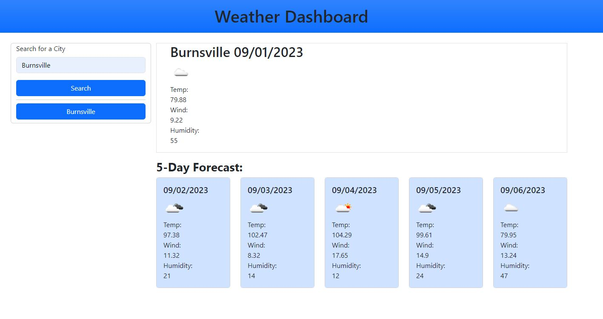

# Weather Dashboard
<!-- Title  -->

## Description

Creating a weather dashboard that shows the weather for today and for 5 days later in the week. 

## Table of Contents

<!-- Table of Contents -->

- [About The Project](#about_project)
- [Deployment Location](#deployment_location)
- [Final Note](#final_note)

---

## About The Project 

<!-- About the Project -->

User is able to put in a city and get the weather the current day and also the weather for the next 5 following days. It will also store the searched city locally so that the user can then retrieve it again. 

### Built With

<!-- Built With -->

This project is built with HTML, CSS, JavaScript, bootstrap, jQuery

### Features

<!-- Features -->

* Current day weather
* Weather for the next 5 days
* Weather icons for quick reference
* Search history

## Deployment Location 

<!-- Deployment Location -->

https://truemiguel.github.io/06-Weather-Dashboard/

---

## Final Note 

<!-- Final Note -->
This weather dashboad will show you the weather for the cities that you select along with a 5 day forecast. 

---